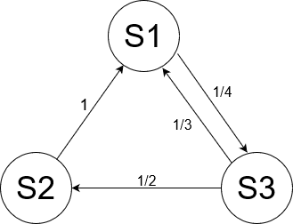

# Билет №3. Граф состояний.

**Используется, когда случайный процесс имеет дискретное мн-во состояний.**

Граф состояний геометрически изображает возможные состояния системы и ее возможные переходы из состояния в состояние.

### Пример
Пусть имеется некоторая система $S$ с дискретными состояниями $S2 , \dots , Sn$. 

**Вершины** - возможные состояния системы, **дуги** - возможные переходы (ориентированный граф) за один шаг. **Подписи дуг** - вероятности перехода. Их удобно представлять в виде матрицы перехода.

$$\displaystyle P = \begin{pmatrix}
\frac{3}{4} & 0           & \frac{1}{4}\\
1           & 0           & 0\\
\frac{1}{3} & \frac{1}{2} & \frac{1}{6}\\
\end{pmatrix}$$

$\displaystyle P_{i, i}$ обычно не проставляются (вероятность задержки, она же вероятность не поменять состояние)

## Создатель

Автор расписанного билета: Клюшов Никита

Кто проверил:

## Ресурсы
- записи лекций Рогова с прошлого года
